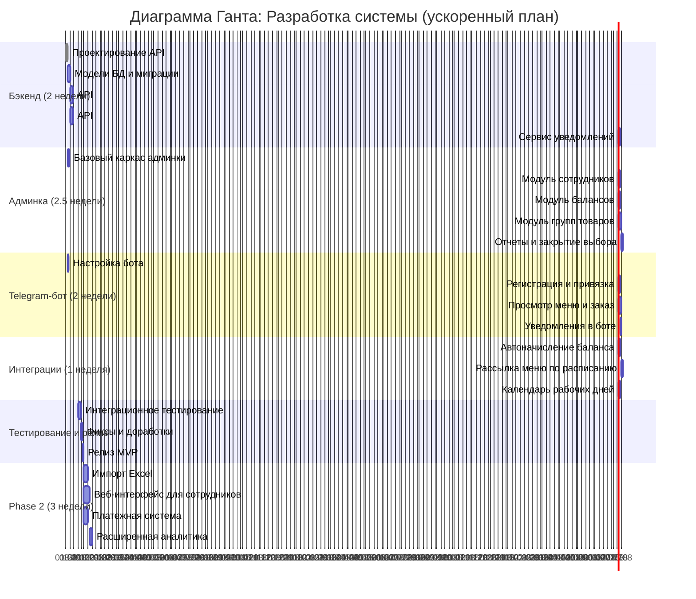
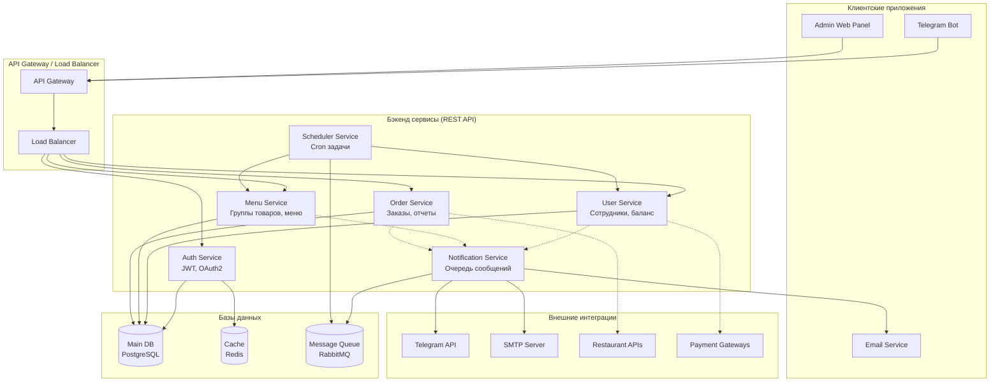
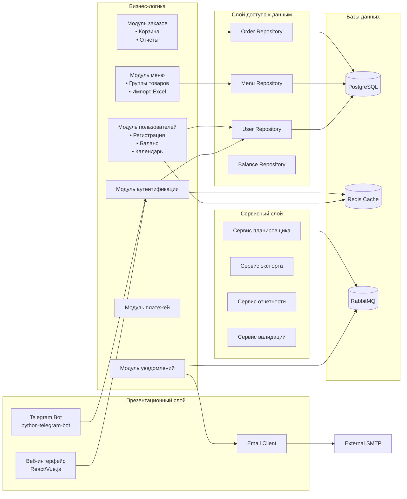

## Архитектура приложения

## Компонентная диаграмма архитектуры

## Описание архитектуры:

### 1. **Многослойная архитектура:**
- **Презентационный слой:** Веб-интерфейс (админка), Telegram-бот, Email-рассылки
- **Бизнес-логика:** Изолированные модули с четкими ответственностями
- **Сервисный слой:** Вспомогательные сервисы (планировщик, экспорт, отчеты)
- **Слой данных:** Репозитории для работы с БД

### 2. **Ключевые компоненты:**

#### **Модуль пользователей:**
- Управление профилями сотрудников
- Баланс и финансовые операции
- Календарь рабочих/нерабочих дней
- Критические лимиты и блокировки

#### **Модуль меню:**
- Группы товаров с привязкой к датам
- Импорт из Excel (шаблон nextweek_menu.xlsx)
- Управление видимостью и сроками
- Валидация данных

#### **Модуль заказов:**
- Корзина и оформление заказа
- Проверка доступности баланса
- Формирование отчетов по закрытым группам
- Экспорт в Excel для ресторанов

#### **Модуль уведомлений:**
- Асинхронная очередь сообщений
- Интеграция с Telegram Bot API
- Email-рассылка через SMTP
- Шаблоны сообщений

#### **Сервис планировщика:**
- Ежедневное начисление баланса
- Автоматическая рассылка меню
- Напоминания о закрытии выбора
- Фоновые задачи

### 3. **Технологический стек:**

#### **Бэкенд:**
- **Язык:** Python (FastAPI/Django) или Node.js (NestJS)
- **Базы данных:** PostgreSQL (основная), Redis (кэш)
- **Очередь сообщений:** RabbitMQ или Celery
- **Документация API:** Swagger/OpenAPI

#### **Фронтенд (админка):**
- **Фреймворк:** React/Vue.js
- **UI библиотека:** Ant Design/Element UI
- **Чарты:** Chart.js или Apache ECharts

#### **Telegram-бот:**
- **Библиотека:** python-telegram-bot или Telegraf.js
- **Вебхуки:** для production окружения

#### **Инфраструктура:**
- **Контейнеризация:** Docker + Docker Compose
- **Оркестрация:** Kubernetes (опционально)
- **CI/CD:** GitLab CI/GitHub Actions
- **Мониторинг:** Prometheus + Grafana

### 4. **Безопасность:**
- JWT токены для аутентификации
- RBAC (ролевая модель доступа)
- Валидация входных данных
- HTTPS для всех соединений
- Защита от SQL-инъекций, XSS, CSRF

### 5. **Масштабируемость:**
- Горизонтальное масштабирование сервисов
- Кэширование частых запросов
- Асинхронная обработка задач
- Репликация баз данных

## Сжатые сроки реализации:

### **Неделя 1-2:**
- Базовый бэкенд с API
- Модели базы данных
- Простая аутентификация

### **Неделя 2-3:**
- Админка: управление сотрудниками
- Telegram-бот: регистрация
- Базовая бизнес-логика

### **Неделя 4:**
- Полный цикл заказа
- Закрытие групп и отчеты
- Интеграционное тестирование

### **Неделя 5:**
- Релиз MVP
- Документация и деплой

### **Неделя 6-8:**
- Дополнительные функции Phase 2
- Улучшение UI/UX
- Оптимизация производительности

Такая архитектура позволяет:
1. Параллельно разрабатывать модули
2. Легко тестировать компоненты изолированно
3. Масштабировать нагрузку на отдельные сервисы
4. Интегрировать новые функции без переписывания кода
