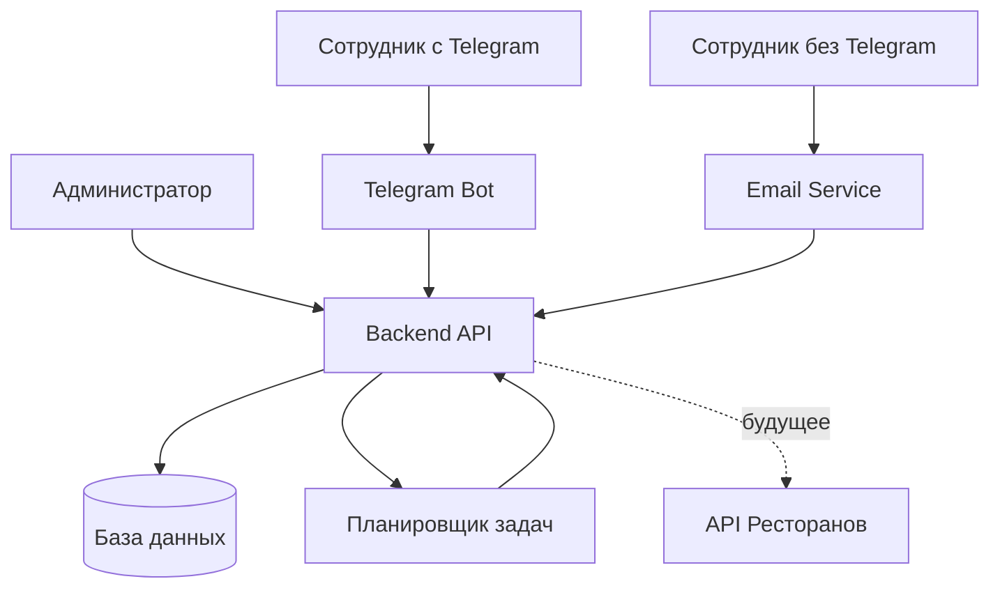
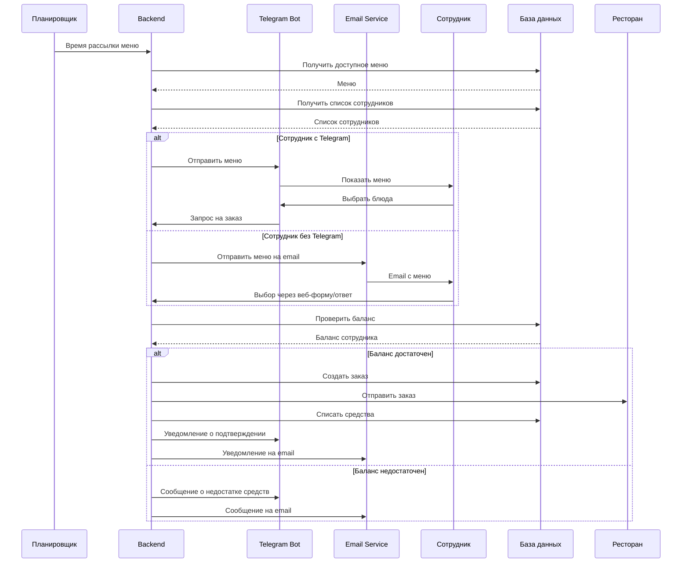
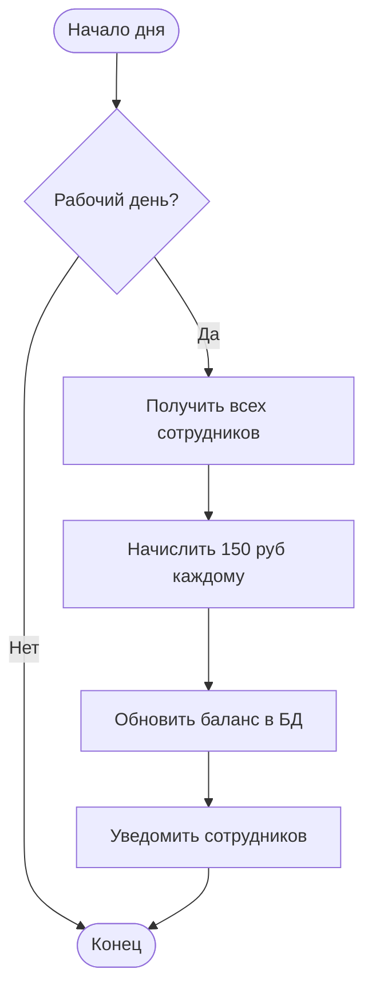
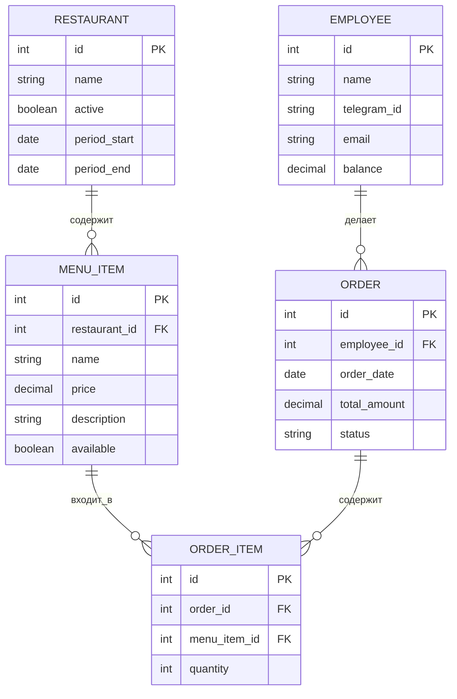

# Техническое задание: Система заказа обедов для сотрудников

## 1. Цель проекта
Автоматизация процесса заказа обедов сотрудниками компании с управлением балансом и интеграцией с ресторанами.

## 2. Основной функционал

### 2.1. Управление меню
- Загрузка меню из одного или нескольких ресторанов
- Настройка доступности ресторанов по периодам (например, только ВкусВилл на текущей неделе)
- Редактирование блюд, цен, описаний

### 2.2. Управление сотрудниками
- Регистрация сотрудников
- Привязка Telegram-аккаунта или email
- Начисление 150 рублей на баланс каждый рабочий день
- Просмотр истории заказов и баланса

### 2.3. Процесс заказа
- Автоматическая рассылка меню в определенное время (настраивается)
- Выбор блюд из доступных ресторанов на день
- Проверка достаточности баланса
- Подтверждение заказа

### 2.4. Уведомления
- Telegram-бот для сотрудников с Telegram
- Email-рассылка для сотрудников без Telegram
- Уведомления о подтверждении заказа, изменении баланса

### 2.5. Автоматизация
- Автоматическое формирование заказов
- Отправка заказов в рестораны (в перспективе через API)
- Списание средств с баланса после подтверждения

## 3. Технические требования

### 3.1. Платформы
- Backend: REST API
- Telegram-бот
- Email-сервис (SMTP)
- Web-интерфейс для администратора (опционально)

### 3.2. Интеграции
- Telegram Bot API
- Email (SMTP)
- API ресторанов (будущая интеграция)

### 3.3. База данных
- Сотрудники (ID, имя, Telegram ID, email, баланс)
- Меню (блюда, рестораны, цены, доступность)
- Заказы (дата, сотрудник, блюда, статус, сумма)
- Настройки (время рассылки, активные рестораны)

## 4. Бизнес-логика

### 4.1. Начисление баланса
- Ежедневное начисление 150 рублей в рабочие дни
- Баланс не переносится на следующий день (или настраивается)

### 4.2. Доступность меню
- Администратор настраивает, какие рестораны доступны в определенный период
- Сотрудники видят только доступные блюда на день заказа

### 4.3. Процесс заказа
1. Рассылка меню в установленное время
2. Сотрудник выбирает блюда
3. Проверка баланса
4. Подтверждение заказа
5. Автоматическая отправка в ресторан
6. Списание средств

## 5. Приоритеты разработки

### MVP (Минимально жизнеспособный продукт)
1. Управление сотрудниками и балансом
2. Загрузка меню
3. Telegram-бот с выбором блюд
4. Email-рассылка для сотрудников без Telegram
5. Автоматическая рассылка меню по расписанию
6. Формирование заказов

### Будущие улучшения
- Интеграция с API ресторанов
- Web-интерфейс для администратора
- Статистика и аналитика
- Мобильное приложение

## 6. Нефункциональные требования
- Надежность: система должна работать в рабочие дни без сбоев
- Производительность: поддержка до 1000 сотрудников
- Безопасность: защита персональных данных, безопасное хранение балансов

## 7. Схемы

### 7.1. Архитектура системы

### 7.2. Процесс заказа

### 7.3. Ежедневное начисление баланса

### 7.4. Структура данных

